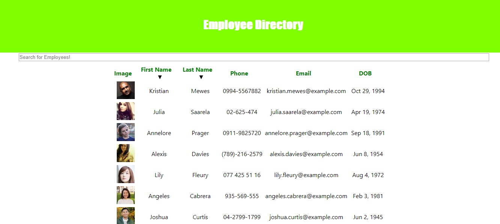

# Employee Directory
## Git: https://github.com/akorjeski/Employee_Directory
## Live Demo: https://quiet-oasis-04144.herokuapp.com/ 

## User Story
As a user, I want to be able to view my entire employee directory at once so that I have quick access to their information.
## Objective
This app uses React and a random "team" generator API to establish an employee directory. The user can then sort this team by first or last name. Additionally, you can search for an employee in the provided search area.

